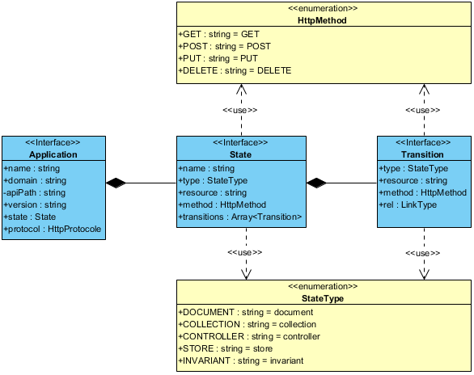

:arrow_forward: [JSAX-RS Documentation](./jsax-rs-reference.md) > REST API> HATOEAS API > JSAX-RS Design

**[WIP]**

# JSAX-RS HATOEAS API Design

## Overview

JSAX-RS HATEOAS API has been designed with Roy T. Fielding's rule in mind:

> A REST API should be entered with no prior knowledge beyond the initial URI and set of standardized media types that are appropriate for the intended audience. [_REST APIs must be hypertext-driven_](https://roy.gbiv.com/untangled/2008/rest-apis-must-be-hypertext-driven)

Since REST is no protocol dependent, our solution is not based upon usual structures, such as [HTML5 (Link types)](https://www.w3.org/TR/html50/links.html#linkTypes), or [RFC 5988 (web linking)](https://tools.ietf.org/html/rfc5988):

_Figure 1: Spring HATEOAS API result sample_

```json
{
  "content":"Hello, User!",
  "_links":{
    "self":{
      "href":"http://api.sample-app.com/1.0/greeting?name=User"
    },
    "users":{
      "href":"http://api.sample-app.com/1.0/users"
    }
  }
}
```

Instead, the JSAX-RS API has been thought around three core components:

- **application**: represents the entire set of functionalities defined for a distributed software
- **state**: specifies the application state for the current endpoint
- **transition**: defines the way to navigate from the current step to another one

All of these entities are exposed as interfaces to ensure weak coupling between the nodes of an application over different networks. The following diagram shows relationships between these entities:

_Figure 2: JSAX-RS HATEOAS API classes diagram_



Thanks to this architecture, we can build and expose useful information to interact with applications:

_Figure 3: JSAX-RS HATEOAS API result sample_

```json
{
    "content": "Hello, User!",
    "application": {
        "name": "helios",
        "version": "1.0",
        "domain": "http://api.sample-app.com",
        "state": {
            "name": "helloUser",
            "type": "document",
            "resource": "/greeting?name=User",
            "transitions": [
                {
                    "type": "collection",
                    "resource": "/users"
                }
            ]
        }
    }
}
```

## Advantages

Hypermedia means that no API documentation is needed to navigate between the application states. So, beyond theory, the main promise of the JSAX-RS HATEOAS API is to provide developer a **a real-life-working hypermedia model**.

The structure in _Figure 3_ follows a basic set of constraints that makes the API understandable by automatized systems:

- separation of concerns
- uniform structure
- semantic information

Thus, even if it is still human-readable, the JSAX-RS HATEOAS API has been designed to be non _human-centric_.

### Separation of concerns

By separating the HATEOAS data structure into three different components, JSAX-RS ensure that client is never responsible for determining the role of each item: the application state, or its possible transitions.

Moreover, client knows where to find relevant information without the need for prior extra knowledge provided by any third party tools (eg: app domain, type of resource, etc.).

### Uniform structure

The `self` and `users` properties, exposed in _Figure 1_, are good examples of what _extra knowledge_ means.

In this sample, client must know that `self` refers to the current state while `users` refers to a collection of the type of `User`. But, no specification exists for this structure. In addition, the application does not provide knowledge to turn that data set into information. Consequently, there is no possibility for a fully independent system to process such a data set without the help of Human beings.

But, the use of a uniform structure solves these issues. If the client [WIP]

### Semantic information

Semantic information provides more flexibility without addition of any contextual knowledge from the API. A well-designed semantic dictionary, adopted by both clients and APIs, introduces ability to design of more complex interactions between components and guarantees the API robustness.

For example, let us consider transitions shown in Figures 4 and 5:

_Figure 4: transition without method definition_

```json
"transitions": [
    {
        "type": "collection",
        "resource": "/users"
    }
]
```

_Figure 5: transition with method definition_

```json
"transitions": [
    {
        "type": "collection",
        "resource": "/users",
        "method": "GET"
    }
]
```

_Figure 4_ means that client have to invoke the HTTP `OPTION` method to know what possible actions to do with this transtion. But, _Figure 5_ indicates that client must invoke the HTTP `GET` method to ensure expected behavior between current state and the state specified by this transtion.


[WIP]


_Figure 6: transition to a controller resource_

```json
"state": [
    {
        "type": "collection",
        "resource": "/documents/ba756938-9e1c-4261-bed3-0898ad8e2a54",
        "method": "GET",
        "transitions": [
            {
                "type": "controller",
                "resource": "/printer/print?printerId=1&documentId=ba756938-9e1c-4261-bed3-0898ad8e2a54"
            }
        ]
    }
]
```